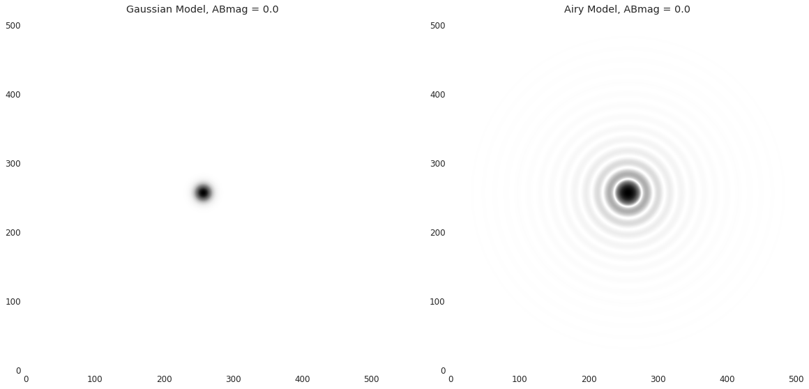

# Indian Spectroscopic and Imaging Space Telescope 

Repo status : Work in Progress

## Introduction

This is a repository dedicated to data simulations for the Indian Spectroscopic and Imaging Space Telescope (INSIST) project. It contains Jupyter Notebooks which can be hosted on cloud platforms such as [Google Colab](https://colab.research.google.com/notebooks/intro.ipynb?utm_source=scs-index), [Binder](https://mybinder.org/), and [Gradient](https://gradient.run/notebooks), and webtools which can be accessed using [Binder](https://mybinder.org/).

This repository contains codes for the following:

*  PSFs simulation using CasJobs and HCIPy python packages, which can simulate any field in the GALEX catalog for a range of telescope apertures, wavelengths and obstruction designs

* PSF analysis routines employed on Zeemax simulations
* UV stellar catalog generator using SED fitting

# Web Tools
* PSF Simulation Tool :  (Work in progress)
 
## Notebooks

* PSF Simulator : [PSF_Simulator.ipynb](https://github.com/Jack3690/INSIST/blob/main/PSF_Simulator.ipynb)
* UV Stellar Catalog Generator : [UV_Stellar_Catalog.ipynb](https://github.com/Jack3690/INSIST/blob/main/UV_Stellar_Catalog.ipynb)

# Usage

## [PSF_Simulator.ipynb](https://github.com/Jack3690/INSIST/blob/main/PSF_Simulator.ipynb) 

In this notebook, we explore how to simulate Points Spread Functions (PSF) with various parameter inputs. The objective is to able to generate a simulated image of a field which can be compared with actual data. This will be helpful at various stages of INSIST developement such as Pipiline validation, science cases pre-observation simulation etc.

### Single PSF Generator

In this section we use Astropy to generate Gaussian and Airy disk PSFs based on FWHM and pixel scale, normalized based on ABmag
##PSF Generator using Source Catalog

 

### PSF using source Catalog and CasJobs

In this section we explore how to use a catalog which is either directly acquired or acquired from MAST Casjobs to generate PSF distribuition of a field.

## [PSF_Analysis.ipynb](https://github.com/Jack3690/INSIST/blob/main/PSF_Analysis.ipynb) 

This notebook contains Python routines used for comparing off axis and on axis PSFs generated using Zeemax. The aim is to quantitatively study how presence of an on-axis secondary modifies the PSF, and how it would affect the expected science cases.

## [UV_Stellar_Catalog.ipynb](https://github.com/Jack3690/INSIST/blob/main/UV_Stellar_Catalog.ipynb) 

This notebook contains routines which allows users to predict UV fluxes of sources using their PanSTARRS optical band magntidues. The objective is to able to generate a catalog of sources in UV band using optical band magnitudes as input. We explore several methods to achieve this.

### SED Fitting

#### SED Fitter

#### SED Fitting routine

# Conclusion/Disclaimer

If you have any questions or suggestions for improvements to this repo,
please contact the owners of the repository.

This is not an official product.

## References
