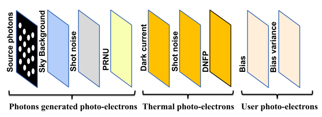

.. pista documentation master file, created by
   sphinx-quickstart on Thu Feb 16 17:23:12 2023.
   You can adapt this file completely to your liking, but it should at least
   contain the root `toctree` directive.

******************************************************
PISTA: Python Image Simulation and Testing Application 
******************************************************

A python-based resolved stellar population image simulation package developed as part of the Indian Spectroscopic and Imaging Space Telescope (INSIST) project.

.. toctree::
   :maxdepth: 1
   :caption: Getting Started:
   
   getting_started
   example
   
.. toctree::
   :maxdepth: 1
   :caption: Modules:
   
   pista

Indices and tables
==================

* :ref:`genindex`
* :ref:`modindex`
* :ref:`search`